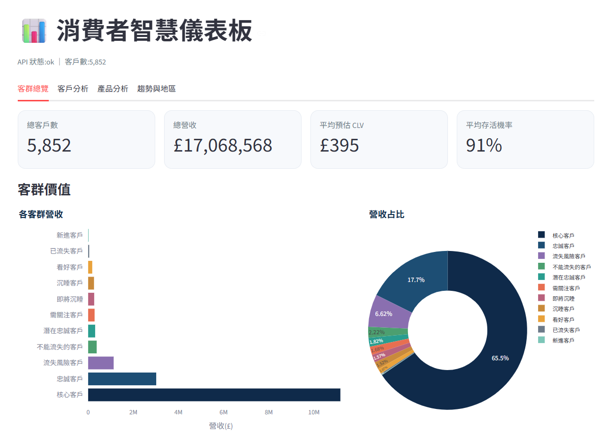
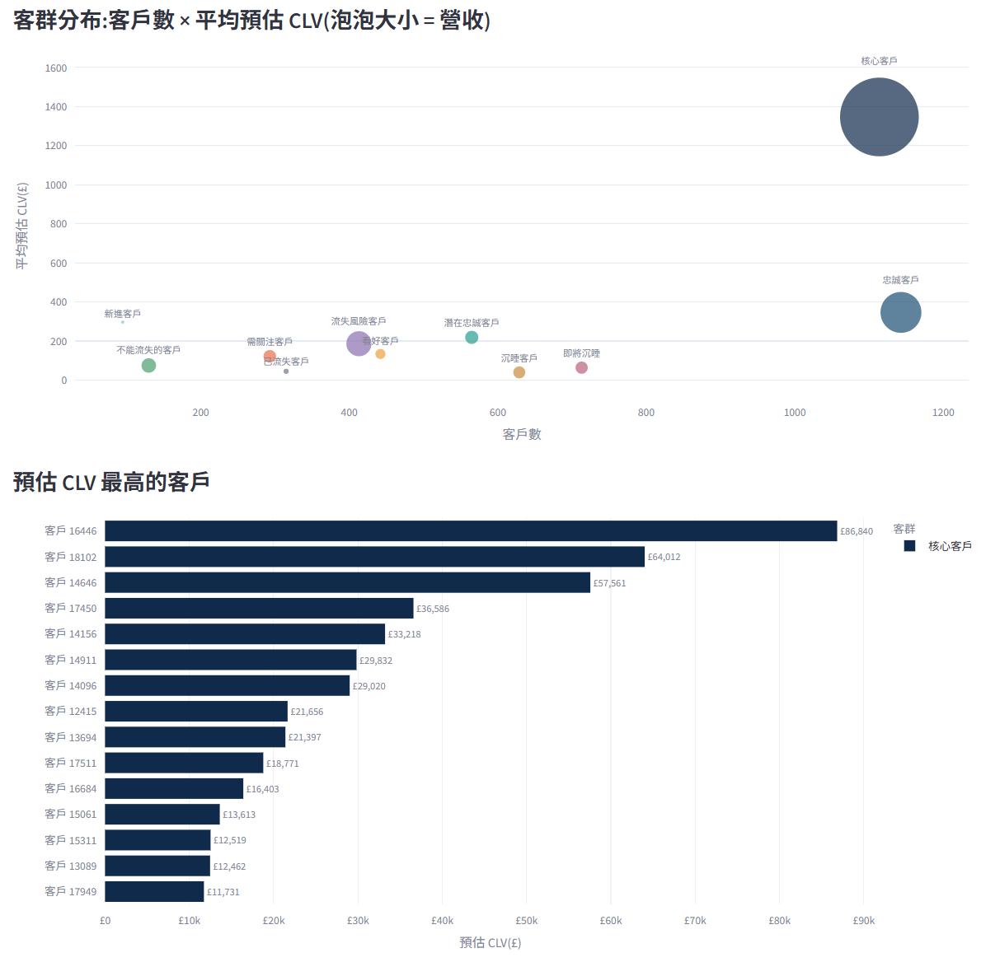
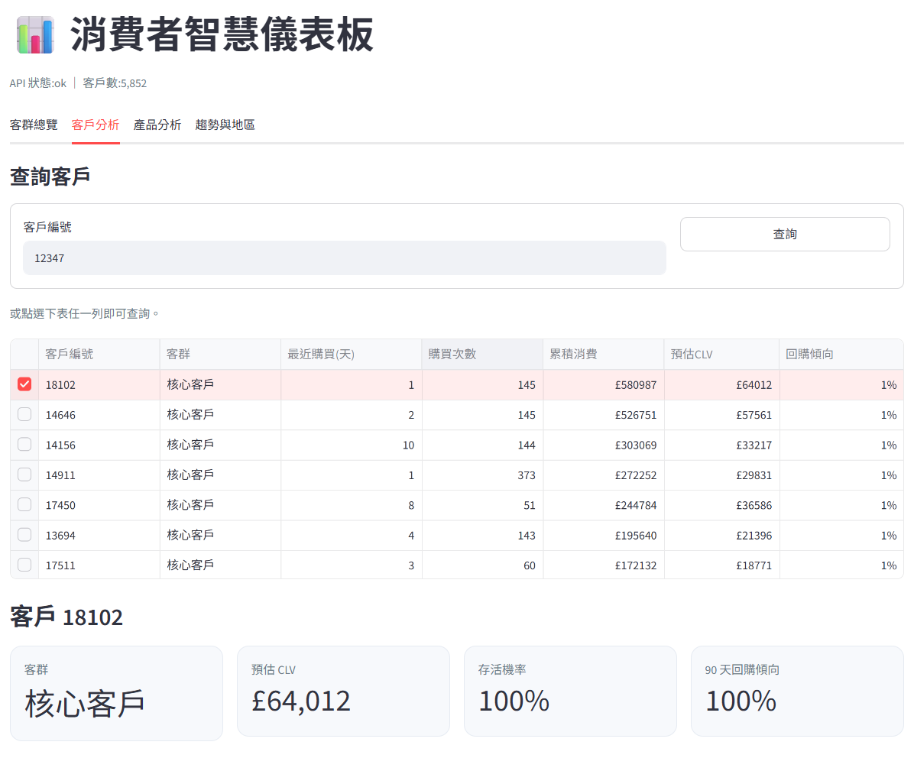
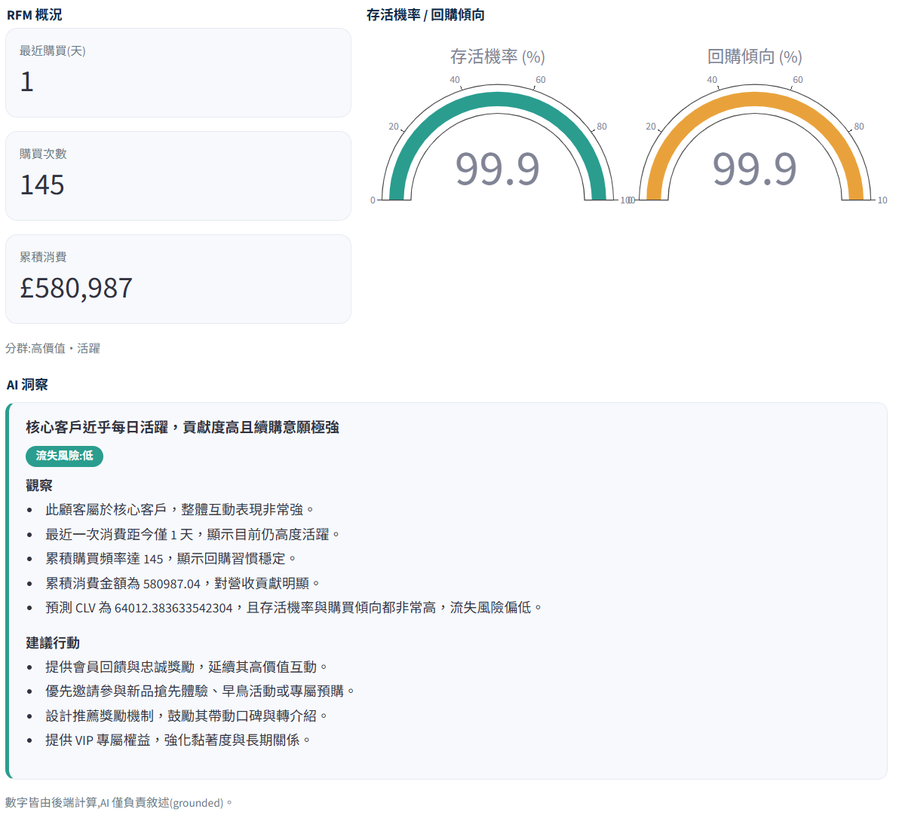
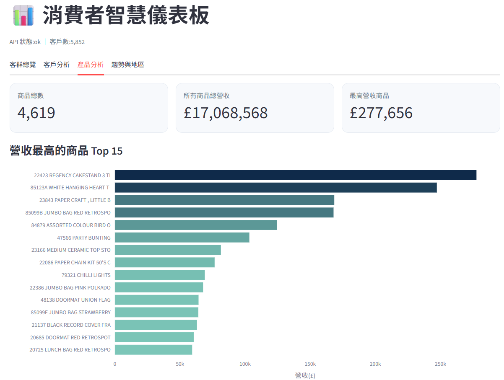
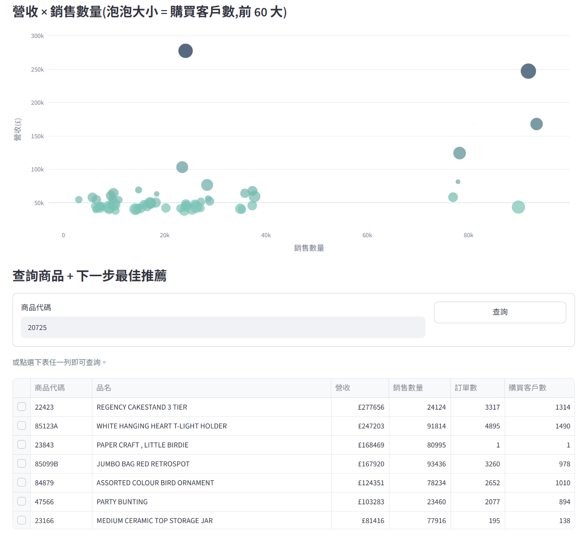
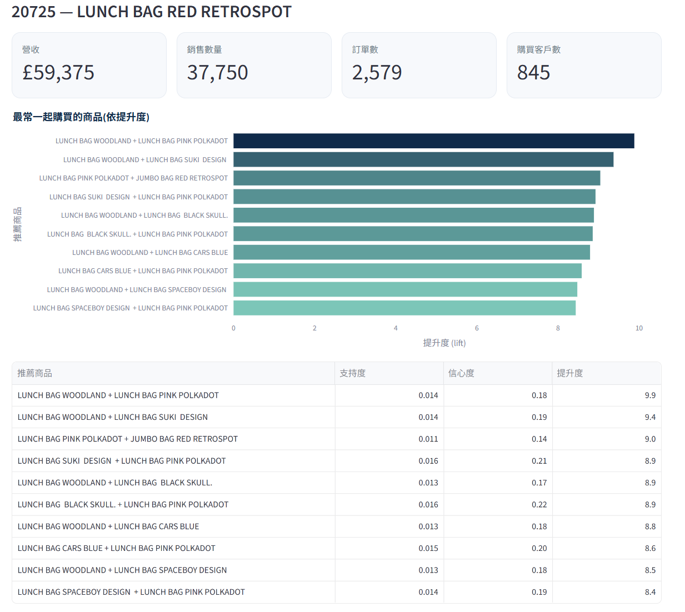
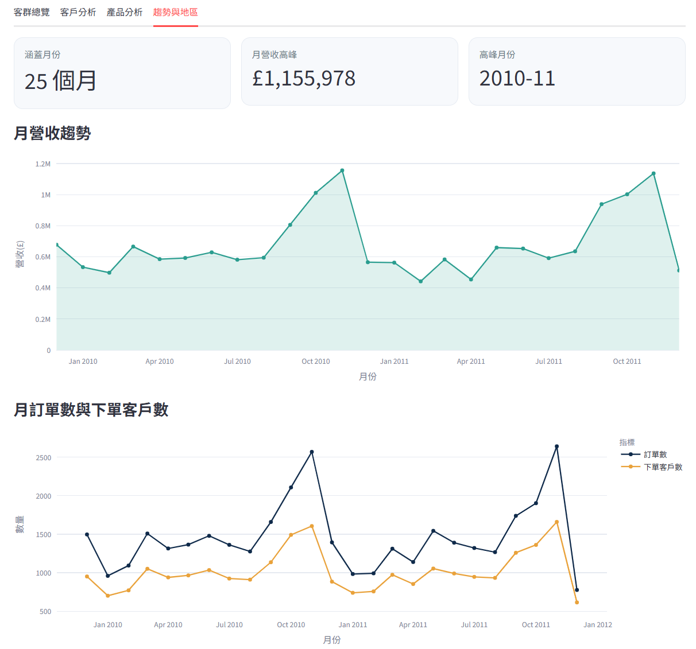
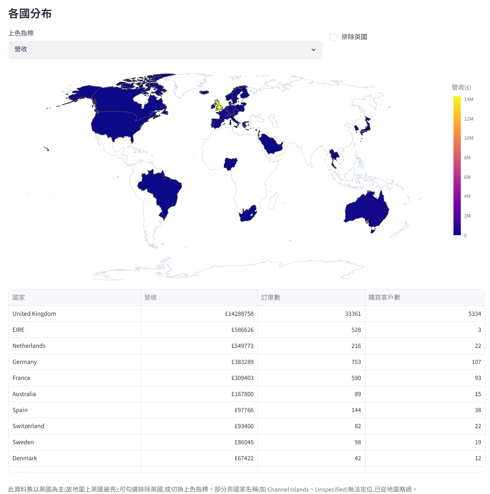

# Consumer Intelligence｜消費者智慧分析


以一份真實電商交易資料,建構涵蓋**客群分群、顧客終身價值（CLV）、Next Best Offer、購買傾向預測**的端到端分析,並產品化為 **PostgreSQL + FastAPI + Streamlit** 的可部署服務,附一層 grounded LLM 洞察 Copilot。個人專案,重點在可驗證的方法與完整的工程實作。

**技術棧**：Python · pandas · scikit-learn · LightGBM · lifetimes · mlxtend · FastAPI · SQLAlchemy · LangChain · Streamlit · Plotly · Docker · pytest · GitHub Actions


## Demo

為避免綁定的 LLM 金鑰遭誤用,線上服務未公開網址;可 clone 後依下方「快速開始」於本機完整執行(含 grounded LLM Copilot)。以下為各分頁截圖。

### 客群總覽



### 客戶分析



### 產品分析




### 趨勢與地區




---

## 專案概述

線上零售商握有兩年、逾百萬筆交易紀錄,但「資料」不等於「決策」。本專案回答一個核心問題:

> 如何用交易資料,把對的 offer 給對的客群,提升再購率與顧客終身價值?

並拆為四個可操作的子問題,分別對應一個分析階段:客群輪廓（分群）、未來價值（CLV）、交叉銷售（Next Best Offer）、再購機率（傾向模型）。最後整合為後端服務與互動儀表板。

**核心設計原則：LLM 與數值計算解耦（grounding）。** 所有 KPI、分群、CLV、lift、傾向分數等數字皆由 Python／SQL 計算,LLM 只負責將既有事實轉為繁體中文敘述,輸出以 Pydantic 驗證並保留可追溯來源,避免幻覺。

---

## 系統架構

```
原始交易 CSV
  └─ Phase 0  清理 + EDA ──────────────► transactions_clean.parquet
       ├─ Phase 1  RFM 分群 + K-means ───► customer_segments.parquet
       ├─ Phase 2  CLV(BG/NBD + Gamma-Gamma)► customer_clv.parquet
       ├─ Phase 3  購物籃關聯規則 → NBO ──► association_rules.parquet
       ├─ Phase 4  購買傾向(LogReg / LightGBM)► propensity_scores.parquet
       └─ build_summaries  產品/月份/國家彙總 ► *_summary.parquet
                                   │
                          load_db  ▼
                  PostgreSQL(正式)/ SQLite(本機・測試)
                                   │
                FastAPI 服務(含 grounded LLM Copilot · /docs)
                                   │
                    Streamlit 互動儀表板(呼叫 API)
```

業務邏輯集中於 `src/consumer_intel/`,前端為薄客戶端,僅呼叫 API 呈現。SQL 採參數化、ANSI 相容查詢,正式（PostgreSQL）與測試（SQLite）共用同一份程式碼。

---

## 主要成果

| 階段 | 方法 | 主要發現 |
|---|---|---|
| 客群分群 | RFM 規則式 + K-means | Champions 佔 19% 客戶、貢獻 65.5% 營收,呈現明顯 80/20 結構 |
| CLV | BG/NBD + Gamma-Gamma | holdout 驗證:預測與實際購買次數相關 0.848,總量誤差 2.2% |
| Next Best Offer | FP-Growth 關聯規則 | 562 項主力商品、944 條規則,依 lift 提供交叉銷售推薦 |
| 購買傾向 | LogReg / LightGBM + SHAP | ROC-AUC 0.804（baseline 勝出），機率已校準可用於 targeting |

資料規模:776,577 筆明細、5,852 位客戶、36,594 筆訂單、4,619 項商品、41 國,總營收約 £17.1M。

---

## 資料與清理（Phase 0）

**資料集**：Online Retail II（UCI id=502 / Kaggle，CC BY 4.0）。英國線上禮品商 2009–2011 交易,約 107 萬筆,同時包含金額、客戶 ID 與重複購買,足以用單一資料集完成 RFM、CLV 與購物籃分析。

清理規則（見 `src/consumer_intel/data/clean.py`,每條皆有對應測試）:

| 步驟 | 移除列數 | 理由 |
|---|---:|---|
| 完全重複列 | 34,335 | 重複匯出 |
| 取消單（`Invoice` 開頭 `C`） | 19,104 | 非實際銷售 |
| 非商品代碼（POST、M、BANK CHARGES…） | 4,791 | 郵資／手續費等管理用代碼 |
| 非正數量（退貨／調整） | 3,362 | 僅保留客戶層正向銷售 |
| 非正單價（免費品／錯誤） | 2,566 | 金額不可信 |
| 缺 `CustomerID` | 226,636 | 無法歸戶 |

清理後保留 776,577 / 1,067,371 列（72.8%），存為 `transactions_clean.parquet`,下游一律讀清理後的檔。主表僅保留可歸戶的正向銷售;退貨與取消若需計算淨營收,可由原始檔重新推導。

---

## 分析階段

各階段的計算邏輯皆位於 `src/`,並產出一份 `reports/*.md`,內含靜態圖表(PNG,已進版控,可直接於 GitHub 檢視)。執行 pipeline 時亦會另存互動式 HTML 圖表,因檔案較大未進版控。

### Phase 1｜客群分群

對 5,852 位客戶計算 RFM,並以兩種互補方法分群。規則式 RFM 產生 11 個行銷語意分群,其中 Champions 佔 19% 客戶、貢獻 65.5% 營收（人均 £10,030）；At Risk 與 Can't Lose Them 合計 543 位高價值但已沉睡的客戶,為 win-back 首要名單。資料驅動的 K-means（log 轉換後,以 silhouette 在 3–8 區間選定 k=4）得到四個群集,其中 High-Value Active 佔 20% 客戶、73% 營收。兩種方法皆指向「約五分之一的客戶撐起三分之二以上營收」,儀表板同時呈現兩種視角。詳見 `reports/phase1_segmentation.md`。

### Phase 2｜顧客終身價值（CLV）

以歷史 CLV 為基準,並用 BG/NBD 估計未來購買次數、Gamma-Gamma 估計每筆金額,得到機率型 CLV。Gamma-Gamma 需重複購買方能估計,故僅在 4,179 位重複客上擬合;1,673 位一次性買家以「BG/NBD 預測次數 × 母體平均客單價」做後備估計,並以 `clv_method` 欄位標記,兩族群不混用。模型以 calibration/holdout 切分驗證（訓練 ≤ 2011-06-12、測試 180 天）：預測與實際購買次數相關係數 0.848,總量預測 7,549 對實際 7,717（低估 2.2%）。接回分群後,Champions 平均預測 CLV £1,346、存活機率 0.99；Can't Lose Them 平均存活機率僅 0.38,獨立印證此群高價值客正在流失。詳見 `reports/phase2_clv.md`。

### Phase 3｜購物籃分析 → Next Best Offer

先剔除長尾稀有商品（僅保留出現於 ≥1% 訂單的 562 項）,再以稀疏矩陣搭配 FP-Growth 挖掘頻繁項集,計算 support、confidence 與 lift,共得 944 條關聯規則。高 lift 規則對應到真實的同系列商品組合（如同主題收藏品、成套派對用品）。Next Best Offer 引擎接受單一商品或購物籃,依 lift 回傳最相關的下一項商品,並自動排除已在籃中的品項。此處僅建立關聯,不宣稱因果——增量效果需 A/B test 驗證。詳見 `reports/phase3_basket_nbo.md`。

### Phase 4｜購買傾向預測

預測客戶是否於未來 90 天內再次購買。採無洩漏的時間切分:特徵僅取自 cutoff（資料最後一天往前 90 天）之前的交易,標籤為 cutoff 之後 90 天內是否再購,且僅納入 cutoff 前有購買紀錄的客戶（5,256 位,正樣本率 43.6%）。特徵為 9 個 RFM 與行為快照（recency、frequency、monetary、tenure、平均客單價、平均購買間隔等）。比較 Logistic Regression baseline 與 LightGBM:baseline 的 ROC-AUC 0.804 / PR-AUC 0.781 略優於 LightGBM 的 0.784 / 0.759。在此資料規模與特徵設計下,主要訊號近乎線性,樹模型的額外複雜度未帶來提升;baseline 的作用即為對照,故如實呈現。SHAP 顯示 recency、recency/tenure 比、平均購買間隔與 monetary 最具影響力;校準檢查顯示預測機率與實際再購率相符,可作為機率用於 targeting。詳見 `reports/phase4_propensity.md`。

---

## Phase 5｜產品化

- **資料層（SQL）**：各階段產出載入五張表——`customers`（RFM／segment／CLV／propensity 合併）、`rules`、`products`、`monthly`、`country`。`db/schema.sql` 為 PostgreSQL DDL,`sql/analytics.sql` 收錄分析查詢,查詢邏輯以參數化 SQL 寫於 `db/repository.py`。
- **API（FastAPI）**：12 個端點（見下表）,Pydantic 定義 response model,互動文件位於 `/docs`。
- **grounded LLM Copilot**：數字與風險等級皆由 Python 計算,LLM 僅產生繁體中文敘述。敘述層以 LangChain 實作（`ChatPromptTemplate | model.with_structured_output(...)`）,其 schema 僅含可敘述的文字欄位,不接觸數字。透過 `init_chat_model` 維持 provider-agnostic（OpenAI／Anthropic 可切換）;線上部署已設定 OpenAI,實際以真實 LLM 產生敘述,本機未設金鑰時自動退回確定性模板,確保離線與 CI 可運行。
- **前端（Streamlit）**：薄客戶端,僅呼叫 API。
- **容器化與部署**：`Dockerfile`、`docker-compose.yml`,以及 Render 的一鍵 Blueprint `render.yaml`。

### 互動儀表板

| 分頁 | 內容 |
|---|---|
| 客群總覽 | 客戶／營收／平均 CLV／存活機率 KPI、各客群營收與占比、客戶數 × 平均 CLV 泡泡圖、預估 CLV 最高客戶 |
| 客戶分析 | 輸入或點選客戶,呈現 RFM、存活與回購儀表、繁中 AI 洞察（含流失風險）;附可點選的客戶瀏覽表 |
| 產品分析 | 商品總數／總營收 KPI、營收 Top 15、營收 × 數量泡泡圖、可點選商品瀏覽表、單品明細與 Next Best Offer |
| 趨勢與地區 | 月營收趨勢、月訂單／客戶數,以及各國營收世界地圖（可切換指標、排除英國） |

### API 端點

| 方法 | 路徑 | 說明 |
|---|---|---|
| GET | `/health` | 服務狀態與客戶數 |
| GET | `/customers` | 客戶清單（依消費排序） |
| GET | `/customers/top-clv` | 預估 CLV 最高的客戶 |
| GET | `/customers/{id}` | 單一客戶完整檔（RFM／CLV／傾向） |
| GET | `/customers/{id}/insight` | grounded LLM 洞察 |
| GET | `/segments` | 各客群彙總 |
| GET | `/products` | 商品清單（依營收排序） |
| GET | `/products/{code}` | 單一商品彙總 |
| GET | `/products/{code}/next-best-offer` | 交叉銷售推薦 |
| GET | `/analytics/products-overview` | 全體商品總數與總營收 |
| GET | `/analytics/monthly` | 月營收／訂單／客戶趨勢 |
| GET | `/analytics/countries` | 各國營收／訂單／客戶 |
| POST | `/campaigns/generate` | 草擬 win-back campaign(執行到 interrupt 為止) |
| GET | `/campaigns` | 列出 campaign 草稿(可依狀態篩選) |
| GET | `/campaigns/{thread_id}` | 單一 campaign 草稿詳情 |
| POST | `/campaigns/{thread_id}/resume` | 人工審核決定(核准／退回修改／終結) |
| GET | `/chat/stream` | 多輪對話式客戶問答,SSE 串流 |

---

## 快速開始

```bash
pip install -e ".[api,app,copilot,dev]"
```

### 直接啟動（使用內附彙總檔,免下載原始資料）

倉庫已附各階段的彙總 parquet,clone 後即可起服務:

```bash
python scripts/load_db.py                       # 載入彙總（預設 SQLite）
alembic upgrade head                             # 建立 Copilot 業務表（conversations/campaign_approvals）
uvicorn consumer_intel.api.app:app --reload     # API + /docs
streamlit run app/dashboard.py                  # 前端（另一終端）
```

API 文件位於 <http://localhost:8000/docs>,前端位於 <http://localhost:8501>。`alembic upgrade head` 只需執行一次(建立 win-back campaign 功能所需的資料表);不執行也不影響既有的分群／CLV／NBO／傾向功能。

### 從原始資料完整重現

```bash
# 1. 下載 Online Retail II CSV 至 data/raw/online_retail_II.csv（UCI id=502 或 Kaggle）
# 2. 依序執行各階段 pipeline
python scripts/run_phase0.py    # 其餘 run_phase1 ~ run_phase4 類推
# 3. 產生彙總並載入資料庫
python scripts/build_summaries.py
python scripts/load_db.py
# (選用)重建報告中的靜態圖表
python scripts/build_report_images.py
```

### Docker

```bash
docker compose up    # 一次啟動 PostgreSQL + API + 前端
```

### 啟用真實 LLM 敘述

於 API 服務設定 `OPENAI_API_KEY`（或 `ANTHROPIC_API_KEY`）,可另設 `LLM_MODEL`、`LLM_PROVIDER`。線上部署已配置 OpenAI 金鑰與模型,Copilot 以真實 LLM 產生繁中敘述;本機未設金鑰時則以確定性模板輸出,功能不受影響。

---

## 部署

`render.yaml` 為 Render Blueprint,一次建立 managed PostgreSQL、API 服務與 Streamlit 服務（共用同一 Docker 映像、以不同啟動腳本區分）。API 啟動時先執行 `load_db.py` 載入資料,前端以 `API_URL` 指向 API 服務,並已設定 `OPENAI_API_KEY` 與 `LLM_MODEL` 以啟用真實 LLM 敘述。金鑰僅存於 Render 環境變數,不寫入倉庫;為避免金鑰遭誤用,線上端點網址亦不對外公開。

> 雲端免費方案具閒置休眠與資料庫期限等限制,且各家條款時有調整,部署前請參閱當下文件。

---

## 測試與工程

- 98+ 個 pytest,涵蓋清理規則、RFM、分群、CLV、關聯規則、傾向特徵與模型、SQL repository、FastAPI 端點,以及 Copilot 的 grounding 與 Pydantic 約束。
- 測試以 SQLite 與 FastAPI `TestClient` 進行,Copilot 走確定性模板路徑,不依賴 PostgreSQL 或真實 LLM 金鑰。
- `ruff` 負責 lint 與格式化;GitHub Actions（`.github/workflows/ci.yml`）於每次 push 與 PR 執行 lint 與測試。

---

## LangGraph Copilot

在既有的 LangChain LCEL Copilot（`copilot/`）之外,新增一套 **LangGraph agentic workflow**（`copilot_graph/`）,展示平行工具調用、條件路由、human-in-the-loop 審核與多輪對話狀態管理。兩套實作並存,LCEL 版本完全不動——為什麼不直接把 LCEL 改成 LangGraph、兩套並存的理由寫在 CLAUDE.md。目前已完成:

- **資料層**:新增 `conversations`／`messages`／`campaign_approvals` 三張業務表,以 SQLAlchemy ORM 建模、Alembic 管理版本(獨立於既有分析表的 pandas 載入流程)。
- **客戶洞察 StateGraph**:`extract_context →(customer_id 可解析?)→ clarify／router →(存在?)→ not_found／(fetch_rfm ‖ fetch_clv ‖ fetch_nbo ‖ fetch_propensity)→ join → response_generator →(LLM 失敗時)→ fallback`。四個 fetch 節點平行執行、fan-in 後產生**對話式**的 grounded 回答(純文字,不是固定的 CustomerInsight 結構);查無客戶與客戶身分無法判斷時直接回傳確定性訊息,不進 LLM;LLM 呼叫失敗會經過顯式的 `fallback` 節點退回模板。`extract_context` 會從對話歷史(含代名詞,例如「他」「那位客戶」)解析出這一輪在問哪位客戶——多輪對話狀態存在 SQLAlchemy `messages` 表,由 `copilot_graph/chat.py` 的 `run_turn()` 每輪重建,這個 graph 本身不用 checkpointer。

### 多輪對話 + SSE 串流

`GET /chat/stream?thread_id=...&message=...`,以 `graph.astream_events(...)` 轉成 SSE(`text/event-stream`)。事件經過 `copilot_graph/streaming.py` 篩選成精簡格式(`node_start`／`node_end`／`token`／`final`／`interrupt`),不直接把 LangChain 原始事件(含完整 state、非 JSON 的訊息物件)丟給前端。前端 Streamlit 新增「**Copilot 對話**」分頁,`st.chat_input` 驅動,每個瀏覽器 session 一個 `thread_id`,可連續追問(例如「12345這位客戶如何?」→「他為什麼被歸為At Risk?」→「那該給他什麼offer?」),不需要每次都重講一次客戶編號。

**兩個誠實的已知限制**:
1. **LLM token 串流未經真實驗證**:本開發環境沒有 OPENAI_API_KEY／ANTHROPIC_API_KEY,`on_chat_model_stream` 事件的轉發邏輯只依 LangChain 文件實作,沒有對著真實 provider 測過。且兩個 LLM 呼叫都用 `with_structured_output`(底層走 tool-calling)做 grounding,串流出來的可能是局部的 tool-call JSON 片段而非可讀文字——前端把 `token` 事件當作「執行中」的進度訊號,實際顯示的文字以 `final` 事件為準。
2. **前端沒有真的用瀏覽器點過**:這個環境沒有 Playwright/chromium-cli 之類的瀏覽器自動化工具。已驗證的是:對著真實跑起來的 FastAPI 伺服器(不是只有 TestClient)發真實 HTTP 請求,SSE 事件序列與最終回覆都正確;Streamlit 頁面在真實 API 前指向下可以載入不報錯。但聊天輸入框的送出/串流顯示,沒有真的點擊驗證過。

**平行 fan-out 的 benchmark**(`python scripts/benchmark_copilot_graph.py`,30 位客戶、本機 SQLite、確定性模板路徑,排除 LLM 呼叫變異):

| 版本 | p50 (ms) | p95 (ms) | mean (ms) |
|---|---|---|---|
| 序列(逐一呼叫四次查詢) | 1.99 | 2.84 | 2.09 |
| LangGraph 平行 fan-out | 3.69 | 4.57 | 3.76 |

**誠實的結論:在本機 SQLite 上,平行版本反而較慢。** SQLite 查詢在毫秒等級、幾乎不涉及真正的網路 I/O 等待(GIL 不太會因此釋放),LangGraph 的執行緒調度與 superstep 管理開銷因此蓋過了任何平行化收益。這個 fan-out 模式預期在正式環境(跨網路的 PostgreSQL,每次查詢有真實往返延遲)會有實際效益,但本開發環境沒有 Docker/Postgres 可用,尚未量測——之後接上正式資料庫後會補上對照數字,不先估算或美化。

### Win-back Campaign 產生器(Human-in-the-Loop)

**為什麼需要人工審核**:發折扣給真實客戶是有金錢成本、有品牌風險、且一旦寄出就不可逆的行為。這不是為了展示 LangGraph 的 `interrupt()` 技術而加的裝飾,而是這個動作本身的業務性質要求必須有人把關。

流程(`copilot_graph/campaign_graph.py`):

```
campaign_intent → build_candidates → match_offers → draft_campaign
  → persist_pending → await_approval(interrupt)
       ├─ 核准     → commit_campaign(寫入 DB)
       ├─ 退回修改 → draft_campaign(帶著審核意見與客戶名單編輯重新草擬)
       └─ 終結     → reject_campaign
```

- **候選名單**:`segment IN (At Risk, Can't Lose Them)`,對應 Phase 1 找到的 543 位高價值但已沉睡的客戶。
- **折扣建議**:依候選名單內 CLV 分位數分三層(前三分之一 20%、中間 15%、後三分之一 10%)——Python 純函式計算,可測試;LLM 完全不接觸個別客戶數字。
- **推薦商品**:沿用 Phase 1 的 `next_best_offers_for_customer`,依客戶最常購買商品配對關聯規則。
- **文案**:整個活動共用一段 LCEL 產生的文案(標題／訴求／賣點),LLM 只看 Python 算好的彙總統計(人數、平均 CLV、平均折扣),看不到任何個別客戶資料;無金鑰或呼叫失敗時退回確定性模板。
- **審核**:LangGraph `interrupt()` + `Command(resume=...)`,checkpointer 用 `SqliteSaver`(本機)/`PostgresSaver`(正式);`campaign_approvals` 的審核紀錄(狀態、審核人、意見、時間)由 SQLAlchemy ORM 寫入,與 checkpointer 各自獨立(見 CLAUDE.md「資料持久化分層」)。

前端新增「**待審核 Campaign**」分頁:產生草稿、瀏覽/編輯候選客戶名單(可勾選剔除、修改個別折扣)、填寫審核意見、核准／退回修改／終結三選一;核准後可下載名單 CSV。API 新增四個端點(見下方「API 端點」表)。

### 一種 Copilot 實作的心得:LCEL vs. LangGraph

這裡原本想比較三種 orchestration(手刻／LCEL／LangGraph),但手刻版本是另一個舊專案,這次沒有帶著它的程式碼一起看,與其憑印象编資料,不如老實只比這個 repo 裡真的並存的兩種實作——數字是真的量出來的,不是估的。

| 面向 | LangChain LCEL(`copilot/`) | LangGraph(`copilot_graph/`) |
|---|---|---|
| 程式碼行數 | 275 行(3 個檔案) | 988 行(10 個檔案)+ 201 行資料層基礎設施(`checkpointer.py`／`campaign_repository.py`／`models.py`) |
| 測試數 | 13 個 | 48 個 |
| 並行支援 | 無,單次 `chain.invoke()` | 原生 fan-out(4 節點平行擷取);但本機 SQLite 上因無真實網路 I/O,平行版本反而比序列慢(見上方 benchmark) |
| 執行持久化 | 無狀態,每次呼叫獨立 | 視流程而定:customer insight 對話歷史存 ORM、graph 本身不用 checkpointer;campaign 審核流程需要 checkpointer(`SqliteSaver`/`PostgresSaver`)才能 `interrupt()`/`resume()` |
| 中斷(恢復)HITL | 不支援,沒有機制可以「停下來等人」 | 原生支援,是這個專案唯一真的需要 HITL 的地方(win-back campaign 發真的折扣) |
| 可觀測性 | 黑盒;敘述失敗只能在外層包 try/except,看不到內部發生什麼 | `astream_events()` 給節點級別的開始/結束/token 事件;失敗路徑是圖上顯式的 `fallback` 節點,不是被吞掉的例外 |
| 學習曲線／維護成本 | 低,一個函式接一個函式,新人一看就懂 | 高,要理解 StateGraph、reducer、conditional edges、interrupt 語意、checkpointer 生命週期 |
| **什麼時候該用它** | 單一意圖、不需要中斷、不需要平行 I/O 的場景 | 需要 HITL、需要跨請求維持對話狀態、或有真正平行 I/O 可以重疊等待時間的場景 |

這個專案讓兩套敘述層在同一個資料庫、同一組事實上做同一件事,差異因此清楚:LCEL 產生一句話就夠用時,LangGraph 完全是額外成本——要多學 StateGraph、reducer、conditional edge,還會踩到不顯而易見的坑(例如 `interrupt()` 前的程式碼在 `resume()` 時會重跑,不注意會意外重複寫入 DB,這是先寫小實驗才發現的,不是憑經驗猜到的)。平行 fan-out 在本機 SQLite 上甚至比序列還慢,因為沒有真正的網路 I/O 可以重疊,執行緒調度的開銷反而倒貼一筆。真正回本的地方只有兩個:win-back campaign 需要對「發真的折扣給真的客戶」這種不可逆動作停下來等人核准,這是 LCEL 原生做不到的;以及多輪對話需要跨請求維持狀態、並可觀測每個節點的執行過程。沒有這兩個理由,LangGraph 只是用更貴的方式做同一件事。

---

## 專案結構

```
consumer-intelligence/
├── README.md · CLAUDE.md · PROJECT_PLAN.md · pyproject.toml
├── data/processed/               # 各階段彙總 parquet(小檔已進版控)
├── src/consumer_intel/
│   ├── config.py · labels.py     # 設定常數 · 中文顯示標籤
│   ├── data/ · eda/ · features/  # 清理 · EDA · RFM 特徵
│   ├── segmentation/ · clv/ · basket/ · propensity/
│   ├── copilot/                  # grounded LLM 洞察層
│   ├── db/                       # engine · loader · SQL repository
│   └── api/                      # FastAPI app · Pydantic models · 依賴
├── app/dashboard.py              # Streamlit 前端
├── db/schema.sql · sql/analytics.sql
├── scripts/                      # run_phase0~4 · build_summaries · load_db · start_*.sh
├── Dockerfile · docker-compose.yml · render.yaml · .streamlit/config.toml
├── reports/                      # 各階段 Markdown 報告 + 靜態 PNG 圖表
├── tests/                        # 各模組對應的 pytest
└── .github/workflows/ci.yml
```

---

## 資料來源

Online Retail II, UCI Machine Learning Repository (id=502)。授權 CC BY 4.0。
