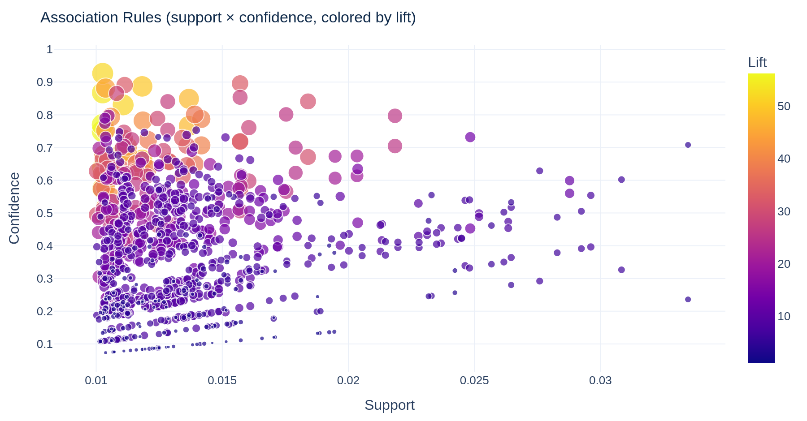

# Phase 3 — Market Basket Analysis & Next Best Offer

Mined **944** association rules from 36,594 baskets over 562 frequent products (products in ≥1% of baskets; FP-Growth, min_support=0.01).

## Top 15 rules by lift

| antecedents                                                       | consequents                                                       |   support |   confidence |   lift |
|:------------------------------------------------------------------|:------------------------------------------------------------------|----------:|-------------:|-------:|
| POPPY'S PLAYHOUSE BEDROOM  + POPPY'S PLAYHOUSE KITCHEN            | POPPY'S PLAYHOUSE LIVINGROOM                                      |    0.0103 |        0.75  |   56.3 |
| POPPY'S PLAYHOUSE LIVINGROOM                                      | POPPY'S PLAYHOUSE BEDROOM  + POPPY'S PLAYHOUSE KITCHEN            |    0.0103 |        0.77  |   56.3 |
| POPPY'S PLAYHOUSE LIVINGROOM  + POPPY'S PLAYHOUSE KITCHEN         | POPPY'S PLAYHOUSE BEDROOM                                         |    0.0103 |        0.868 |   53.9 |
| POPPY'S PLAYHOUSE BEDROOM                                         | POPPY'S PLAYHOUSE LIVINGROOM  + POPPY'S PLAYHOUSE KITCHEN         |    0.0103 |        0.637 |   53.9 |
| POPPY'S PLAYHOUSE KITCHEN                                         | POPPY'S PLAYHOUSE BEDROOM  + POPPY'S PLAYHOUSE LIVINGROOM         |    0.0103 |        0.575 |   51.9 |
| POPPY'S PLAYHOUSE BEDROOM  + POPPY'S PLAYHOUSE LIVINGROOM         | POPPY'S PLAYHOUSE KITCHEN                                         |    0.0103 |        0.927 |   51.9 |
| POPPY'S PLAYHOUSE LIVINGROOM                                      | POPPY'S PLAYHOUSE BEDROOM                                         |    0.0111 |        0.83  |   51.5 |
| POPPY'S PLAYHOUSE BEDROOM                                         | POPPY'S PLAYHOUSE LIVINGROOM                                      |    0.0111 |        0.687 |   51.5 |
| POPPY'S PLAYHOUSE LIVINGROOM                                      | POPPY'S PLAYHOUSE KITCHEN                                         |    0.0118 |        0.887 |   49.7 |
| POPPY'S PLAYHOUSE KITCHEN                                         | POPPY'S PLAYHOUSE LIVINGROOM                                      |    0.0118 |        0.662 |   49.7 |
| POPPY'S PLAYHOUSE KITCHEN                                         | POPPY'S PLAYHOUSE BEDROOM                                         |    0.0137 |        0.766 |   47.6 |
| POPPY'S PLAYHOUSE BEDROOM                                         | POPPY'S PLAYHOUSE KITCHEN                                         |    0.0137 |        0.849 |   47.6 |
| SET/20 RED RETROSPOT PAPER NAPKINS  + SET/6 RED SPOTTY PAPER CUPS | SET/6 RED SPOTTY PAPER PLATES                                     |    0.0104 |        0.882 |   44   |
| SET/6 RED SPOTTY PAPER PLATES                                     | SET/20 RED RETROSPOT PAPER NAPKINS  + SET/6 RED SPOTTY PAPER CUPS |    0.0104 |        0.517 |   44   |
| BLUE  SPOTTY CUP                                                  | PINK  SPOTTY CUP                                                  |    0.0112 |        0.683 |   42.8 |

## Next Best Offer examples

Given a seed product, the engine returns the highest-lift products to recommend next (excluding the seed).

**Seed: 22423 — REGENCY CAKESTAND 3 TIER**

|   StockCode | Description                     |   lift |   confidence |
|------------:|:--------------------------------|-------:|-------------:|
|       22698 | PINK REGENCY TEACUP AND SAUCER  |    6.4 |        0.112 |
|       22699 | ROSES REGENCY TEACUP AND SAUCER |    6.4 |        0.112 |
|       22697 | GREEN REGENCY TEACUP AND SAUCER |    6.3 |        0.116 |
|       21843 | RED RETROSPOT CAKE STAND        |    3.1 |        0.116 |
|       84879 | ASSORTED COLOUR BIRD ORNAMENT   |    1.6 |        0.122 |

**Seed: 85123A — WHITE HANGING HEART T-LIGHT HOLDER**

| StockCode   | Description                       |   lift |   confidence |
|:------------|:----------------------------------|-------:|-------------:|
| 22804       | CANDLEHOLDER PINK HANGING HEART   |    5.2 |        0.088 |
| 21733       | RED HANGING HEART T-LIGHT HOLDER  |    5   |        0.236 |
| 82482       | WOODEN PICTURE FRAME WHITE FINISH |    3.1 |        0.088 |
| 82494L      | WOODEN FRAME ANTIQUE WHITE        |    3.1 |        0.088 |
| 22189       | CREAM HEART CARD HOLDER           |    3   |        0.099 |

**Seed: 47566 — PARTY BUNTING**

| StockCode   | Description                        |   lift |   confidence |
|:------------|:-----------------------------------|-------:|-------------:|
| 23298       | SPOTTY BUNTING                     |    6.4 |        0.187 |
| 85123A      | WHITE HANGING HEART T-LIGHT HOLDER |    1.5 |        0.212 |

**Seed: 20725 — LUNCH BAG RED RETROSPOT**

| StockCode   | Description             |   lift |   confidence |
|:------------|:------------------------|-------:|-------------:|
| 22384       | LUNCH BAG PINK POLKADOT |    9.9 |        0.182 |
| 20726       | LUNCH BAG WOODLAND      |    9.9 |        0.182 |
| 22383       | LUNCH BAG SUKI  DESIGN  |    9.4 |        0.186 |
| 85099B      | JUMBO BAG RED RETROSPOT |    9   |        0.142 |
| 20727       | LUNCH BAG  BLACK SKULL. |    8.9 |        0.172 |

## Charts

*關聯規則散布:support × confidence,以 lift 著色與大小編碼。*
